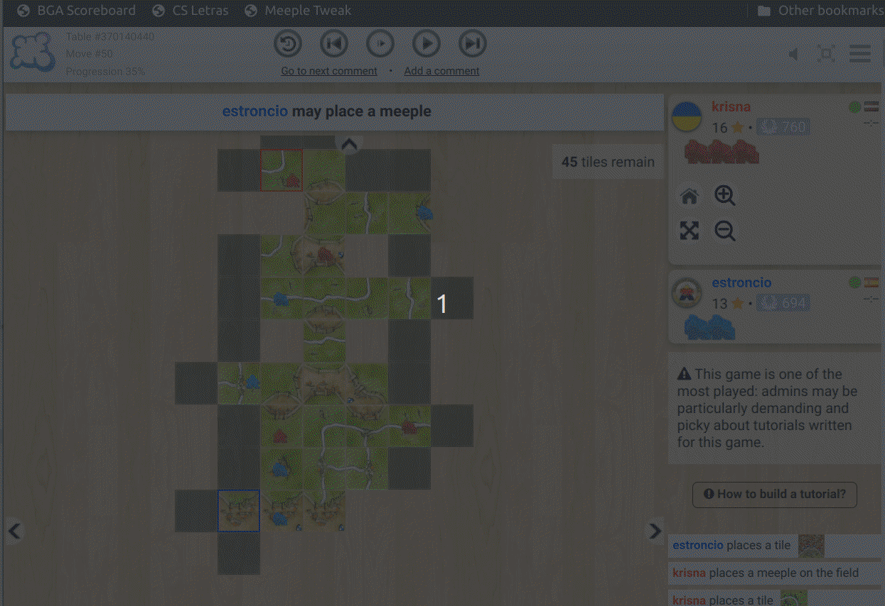
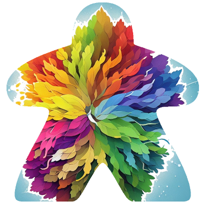

#  bga-carcassonne-meeple-tweak


Tweak meeple colors in [BGA](https://boardgamearena.com/) Carcassonne games.

## ✨ Demo


## 📦 Setup
Create a new bookmark in your browser that points to this "address":

```
javascript:(()=> { 'use strict';const classNames=['partisan_0000ff', 'partisan_ff0000', 'partisan_ffa500', 'partisan_008000', 'partisan_000000']; const classSettings={}; const userIds={};const observer=new MutationObserver((mutationsList)=> { for (const mutation of mutationsList) { if (mutation.type !=='childList') { continue; }for (const addedNode of mutation.addedNodes) { if (addedNode.nodeType===Node.ELEMENT_NODE) { for (const className of classNames) { if (addedNode.classList.contains(className)) { applyCustomStyle(className); } } } } } }); observer.observe(document.body, { childList: true, subtree: true });function attachClickListener(el, className) { el.addEventListener('click', (e)=> { e.stopPropagation(); colorPicker.dataset.activeClass=className;colorPicker.style.display='block'; colorPicker.style.top=e.pageY + 'px'; colorPicker.style.left=(e.pageX - colorPicker.offsetWidth) + 'px';if (!classSettings[className]) { return; }rBackground.value=classSettings[className].rBackground; gBackground.value=classSettings[className].gBackground; bBackground.value=classSettings[className].bBackground; aBackground.value=classSettings[className].aBackground; hMeeple.value=classSettings[className].hMeeple; sMeeple.value=classSettings[className].sMeeple; borderStyle.value=classSettings[className].borderStyle; borderWidth.value=classSettings[className].borderWidth; borderRadius.value=classSettings[className].borderRadius; rBorder.value=classSettings[className].rBorder; gBorder.value=classSettings[className].gBorder; bBorder.value=classSettings[className].bBorder; imgSelected.value=classSettings[className].imgSelected;for (const meepleImg of colorPicker.querySelectorAll('img')) { if (meepleImg.dataset.url===imgSelected.value) { meepleImg.style.backgroundColor='#333'; } else { meepleImg.style.removeProperty('background-color'); } }}); }const colorPicker=document.createElement('div'); colorPicker.style.display='none'; colorPicker.style.position='fixed'; colorPicker.style.zIndex='1000'; colorPicker.style.backgroundColor='#eeefef'; colorPicker.style.border='1px solid black'; colorPicker.style.padding='15px'; colorPicker.style.width='400px'; colorPicker.style.border='2px solid black'; colorPicker.style.boxShadow='7px 7px #444'; document.body.appendChild(colorPicker);const topPanel=document.createElement('div'); const leftPanel=document.createElement('div'); const rightPanel=document.createElement('div'); leftPanel.style.display='inline-block'; leftPanel.style.width='50%'; rightPanel.style.display='inline-block'; rightPanel.style.width='50%'; rightPanel.style.verticalAlign='top'; colorPicker.appendChild(topPanel); colorPicker.appendChild(leftPanel); colorPicker.appendChild(rightPanel);const customImgLabel=document.createElement('p'); customImgLabel.textContent='Custom Image'; customImgLabel.style.fontWeight='bold'; topPanel.appendChild(customImgLabel);const imgSelected=document.createElement('input'); imgSelected.type='hidden'; topPanel.appendChild(imgSelected);const img1=createImageElement(topPanel, 'https://i.imgur.com/PmGreEq.png', 'https://i.imgur.com/yYjTT2V.png', 'White outline around meeple'); const img2=createImageElement(topPanel, 'https://i.imgur.com/pgX4I7n.png', 'https://i.imgur.com/Ifon137.png', 'Inverted outline around meeple'); const img3=createImageElement(topPanel, 'https://i.imgur.com/yEHLQEa.png', 'https://i.imgur.com/lAWfHgc.png', 'Spanish outfit'); const img4=createImageElement(topPanel, 'https://i.imgur.com/Dp1qgeA.png', 'https://i.imgur.com/jKGzv6b.png', 'Spiderman Meeple'); const img5=createImageElement(topPanel, 'https://i.imgur.com/aFWJmbq.png', 'https://i.imgur.com/L5xlnGE.png', 'Dan Chard Meeple'); const meepleLabel=document.createElement('p'); meepleLabel.textContent='Meeple Color'; meepleLabel.style.fontWeight='bold'; leftPanel.appendChild(meepleLabel);const hMeeple=createRangeInput(leftPanel, 'Hue Rotation', 0, 360, 0, 1); const sMeeple=createRangeInput(leftPanel, 'Saturation', 0, 5, 1, 0.05);const backgroundLabel=document.createElement('p'); backgroundLabel.textContent='Background Color'; backgroundLabel.style.fontWeight='bold'; leftPanel.appendChild(backgroundLabel);const rBackground=createRangeInput(leftPanel, 'Red', 0, 255, 0, 1); const gBackground=createRangeInput(leftPanel, 'Green', 0, 255, 0, 1); const bBackground=createRangeInput(leftPanel, 'Blue', 0, 255, 0, 1); const aBackground=createRangeInput(leftPanel, 'Alpha', 0, 1, 0, 0.05);const borderLabel=document.createElement('p'); borderLabel.textContent='Border'; borderLabel.style.fontWeight='bold'; borderLabel.style.textAlign='right'; rightPanel.appendChild(borderLabel);const borderStyle=createSelectInput(rightPanel, 'Style', ['none', 'solid', 'dashed', 'dotted', 'double', 'groove', 'ridge', 'inset', 'outset'], 'none'); const borderWidth=createRangeInput(rightPanel, 'Width', 0, 10, 0, 0.2); const borderRadius=createRangeInput(rightPanel, 'Radius', 0, 15, 0, 0.2); const rBorder=createRangeInput(rightPanel, 'Red', 0, 255, 0, 1); const gBorder=createRangeInput(rightPanel, 'Green', 0, 255, 0, 1); const bBorder=createRangeInput(rightPanel, 'Blue', 0, 255, 0, 1);const buttonContainer=document.createElement('div'); buttonContainer.style.display='flex'; buttonContainer.style.justifyContent='center'; buttonContainer.style.flexWrap='wrap'; colorPicker.appendChild(buttonContainer);const saveBtn=document.createElement('button'); saveBtn.textContent='\u{1F4BE} Save'; saveBtn.title='Save settings for players with this color'; saveBtn.classList='action-button bgabutton bgabutton_blue'; saveBtn.style.display='inline-block'; saveBtn.style.width='35%'; saveBtn.style.marginLeft='0px'; buttonContainer.appendChild(saveBtn);const saveUserBtn=document.createElement('button'); saveUserBtn.textContent='\u{1F464} Save for user'; saveUserBtn.title='Save settings for current user only'; saveUserBtn.classList='action-button bgabutton bgabutton_gray'; saveUserBtn.style.display='inline-block'; saveUserBtn.style.width='35%'; saveUserBtn.style.marginLeft='5px'; saveUserBtn.style.color='white'; buttonContainer.appendChild(saveUserBtn);const resetBtn=document.createElement('button'); resetBtn.textContent='\u{267B}'; resetBtn.title='Reset Settings'; resetBtn.classList='bgabutton bgabutton_gray'; resetBtn.style.display='inline-block'; resetBtn.style.width='15%'; resetBtn.style.marginLeft='5px'; resetBtn.style.color='orangered'; buttonContainer.appendChild(resetBtn);for (const className of classNames) {for (const element of document.querySelectorAll('.player_board_content')) { if (element.querySelector(`.${className}`) !==null) { userIds[className]=element.id.replace('player_board_', ''); break; } }loadConfig(className);const elements=document.getElementsByClassName(className); for (const el of elements) { attachClickListener(el, className); } }saveBtn.addEventListener('click', ()=> { updateSettingsAndApply(); saveConfig(false); colorPicker.style.display='none'; });saveUserBtn.addEventListener('click', ()=> { updateSettingsAndApply(); saveConfig(true); colorPicker.style.display='none'; });resetBtn.addEventListener('click', ()=> { rBackground.value=0; gBackground.value=0; bBackground.value=0; aBackground.value=0; hMeeple.value=0; sMeeple.value=1; borderStyle.value='none'; borderRadius.value=0; borderWidth.value=0; rBorder.value=0; gBorder.value=0; bBorder.value=0; imgSelected.value=''; updateSettingsAndApply(); removeConfig(); colorPicker.style.display='none'; });document.body.addEventListener('click', (e)=> { if (e.target !==colorPicker && !colorPicker.contains(e.target)) { colorPicker.style.display='none'; } });function createImageElement(parent, srcUrl, url, altText) { const img=document.createElement('img'); img.src=srcUrl; img.title=altText; img.alt=altText; img.style.width='50px'; img.style.height='50px'; img.style.paddingLeft='5px'; img.style.paddingRight='5px'; img.style.cursor='pointer'; img.style.borderRadius='15px'; img.style.padding='3px'; img.dataset.url=url;parent.appendChild(img); img.addEventListener('click', ()=> { imgSelected.value=url; updateSettingsAndApply(); });img.addEventListener("mouseover", ()=> { img.style.filter="brightness(150%)"; });img.addEventListener("mouseout", ()=> { img.style.filter="brightness(100%)"; }); return img; }function createSelectInput(parent, labelText, options, defaultValue) { const inputWrapper=document.createElement('div'); inputWrapper.style.display='flex'; inputWrapper.style.alignItems='center'; inputWrapper.style.justifyContent='space-between'; inputWrapper.style.marginBottom='5px';const label=document.createElement('span'); label.textContent=labelText; label.style.flex='1'; label.style.textAlign='right';const input=document.createElement('select'); for (const option of options) { const optionElement=document.createElement('option'); optionElement.value=option; optionElement.textContent=option; input.appendChild(optionElement); } input.value=defaultValue; input.style.marginLeft='10px';inputWrapper.appendChild(label); inputWrapper.appendChild(input);parent.appendChild(inputWrapper); input.addEventListener('input', updateSettingsAndApply);return input; }function createRangeInput(parent, labelText, minValue, maxValue, defaultValue, step) { const inputWrapper=document.createElement('div'); inputWrapper.style.display='flex'; inputWrapper.style.alignItems='center'; inputWrapper.style.justifyContent='space-between'; inputWrapper.style.marginBottom='5px';const label=document.createElement('span'); label.textContent=labelText; label.style.flex='1'; label.style.textAlign='right'; label.addEventListener('mousedown', onDragStart);const input=document.createElement('input'); input.type='range'; input.min=minValue; input.max=maxValue; input.step=step; input.value=defaultValue; input.style.width='60%'; input.style.marginLeft='10px';inputWrapper.appendChild(label); inputWrapper.appendChild(input);parent.appendChild(inputWrapper); input.addEventListener('input', updateSettingsAndApply);return input; }function applyCustomStyle(className) { console.debug(`Apply custom style for ${className}`);const settings=classSettings[className]; const elements=document.getElementsByClassName(className); const newBGColor=`rgba(${settings.rBackground}, ${settings.gBackground}, ${settings.bBackground}, ${settings.aBackground})`; const filter=`hue-rotate(${settings.hMeeple}deg) saturate(${settings.sMeeple})`; const borderColor=`rgba(${settings.rBorder}, ${settings.gBorder}, ${settings.bBorder}`;for (const el of elements) { el.style.backgroundColor=newBGColor; el.style.filter=filter; el.style.borderStyle=settings.borderStyle; el.style.borderRadius=`${settings.borderRadius}px`; el.style.borderWidth=`${settings.borderWidth}px`; el.style.borderColor=borderColor; if (settings.imgSelected) { el.style.backgroundImage=`url(${settings.imgSelected})`; if (!el.style.backgroundSize) { el.style.backgroundSize='150px 180px'; } } else { el.style.removeProperty('background-image') } } }function updateSettingsAndApply() { const className=colorPicker.dataset.activeClass; console.debug(`Update *current* settings for ${className}`);classSettings[className]={ rBackground: rBackground.value, gBackground: gBackground.value, bBackground: bBackground.value, aBackground: aBackground.value, hMeeple: hMeeple.value, sMeeple: sMeeple.value, borderStyle: borderStyle.options[borderStyle.selectedIndex].value, borderWidth: borderWidth.value, borderRadius: borderRadius.value, rBorder: rBorder.value, gBorder: gBorder.value, bBorder: bBorder.value, imgSelected: imgSelected.value }; applyCustomStyle(className);for (const meepleImg of colorPicker.querySelectorAll('img')) { if (meepleImg.dataset.url===imgSelected.value) { meepleImg.style.backgroundColor='#333'; } else { meepleImg.style.removeProperty('background-color'); } } }function loadConfig(className) { console.debug(`Load settings for ${className}`); for (const key of [userIds[className], className]) { const cookieValue=document.cookie .split('; ') .find((row)=> row.startsWith(`colorPickerSettings_${key}=`)) ?.split('=')[1];if (cookieValue) { const settings=JSON.parse(cookieValue); classSettings[className]=settings; applyCustomStyle(className); break; } } }function saveConfig(forCurrentUser) { const className=colorPicker.dataset.activeClass; console.debug(`Save settings for ${className}`);const settings=classSettings[className]; const settingsJSON=JSON.stringify(settings); const expiryDate=new Date(); expiryDate.setFullYear(expiryDate.getFullYear() + 100);const key=forCurrentUser ? userIds[className] : className; document.cookie=`colorPickerSettings_${key}=${settingsJSON}; expires=${expiryDate.toUTCString()}; path=/`; }function removeConfig() { const className=colorPicker.dataset.activeClass; let key=className;const userId=userIds[className]; const allCookies=decodeURIComponent(document.cookie).split('; '); if (allCookies.find((row)=> row.startsWith(`colorPickerSettings_${userId}`))) { key=userId; }console.debug(`Remove settings for ${key}`); document.cookie=`colorPickerSettings_${key}=; expires=Thu, 01 Jan 1970 00:00:00 UTC; path=/`; }let isDragging=false; let lastMousePosition={ x: 0, y: 0 };function onDragStart(e) { isDragging=true; lastMousePosition={ x: e.clientX, y: e.clientY }; colorPicker.style.cursor='grabbing'; }function onDragMove(e) { if (!isDragging) return; const deltaX=e.clientX - lastMousePosition.x; const deltaY=e.clientY - lastMousePosition.y; colorPicker.style.left=`${colorPicker.offsetLeft + deltaX}px`; colorPicker.style.top=`${colorPicker.offsetTop + deltaY}px`; lastMousePosition={ x: e.clientX, y: e.clientY }; }function onDragEnd() { isDragging=false; colorPicker.style.cursor='grab'; }meepleLabel.addEventListener('mousedown', onDragStart); backgroundLabel.addEventListener('mousedown', onDragStart); borderLabel.addEventListener('mousedown', onDragStart); document.addEventListener('mousemove', onDragMove); document.addEventListener('mouseup', onDragEnd); meepleLabel.style.cursor='grab'; backgroundLabel.style.cursor='grab'; borderLabel.style.cursor='grab';
})();
```

## 📝 Warnings
Works in progress, lot of things TODO:
* Clean and review code.
* Test and fix stuff.
* Add more custom images for meeples.

## 👷 Contributing
1. Change whatever you need inside [src/meeple_tweak.js](src/meeple_tweak.js).
2. Update bookmarlet in README.md by running [bin/update_readme](bin/update_readme) (requires [nodejs](https://nodejs.dev/)).
3. Test, commit, push, PR.

### Adding images

If you want your own personalized meeples.

1. Use [this image](img/meeples900x1080.png) as starting point.
2. Tweak the image to have your own meeples.
3. Send me the image and I'll add it.

## 📜 License
[GPL v3](https://www.gnu.org/licenses/gpl-3.0.en.html)


